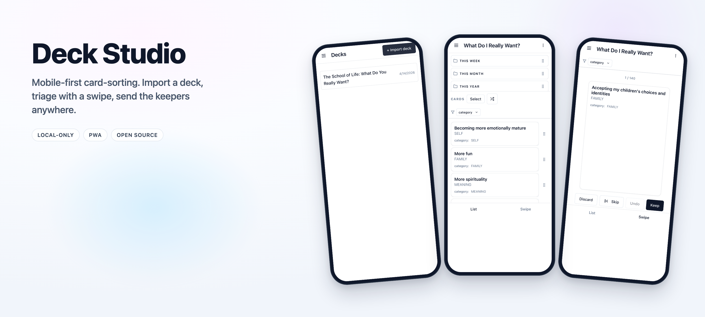
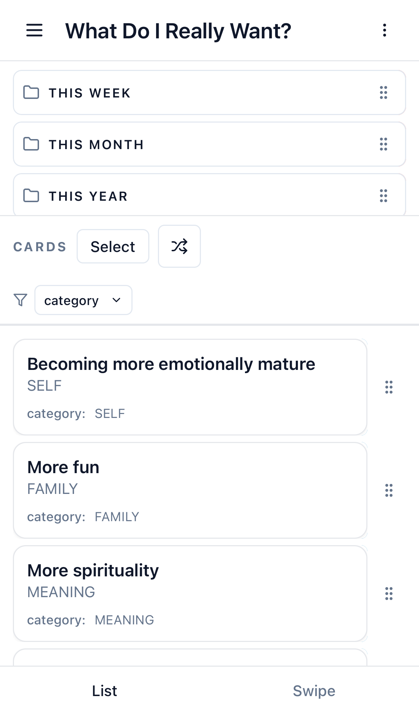
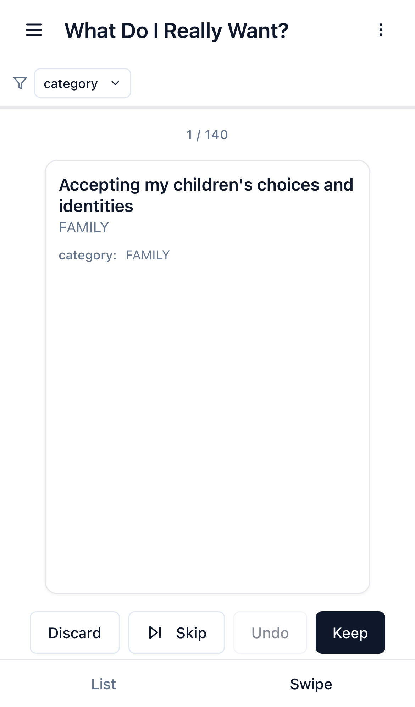
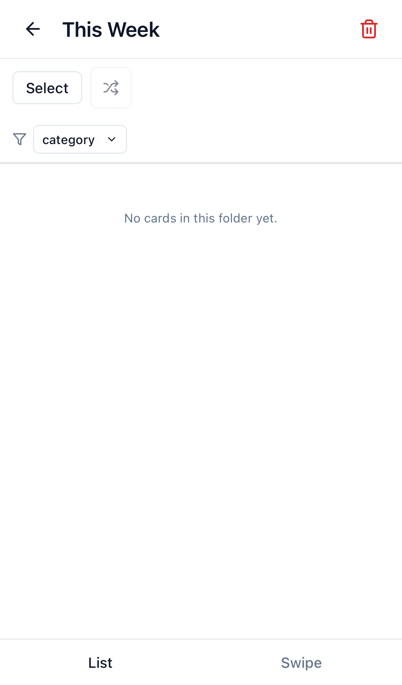
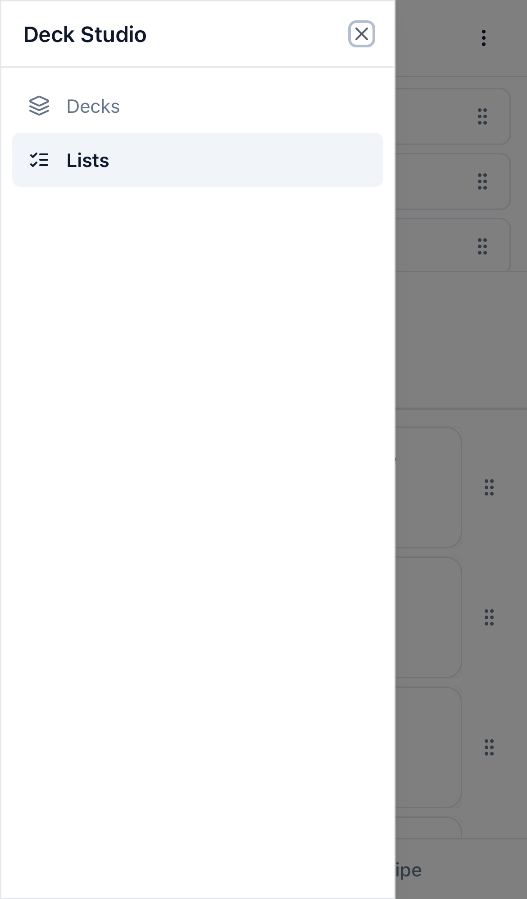

<div align="center">



**A mobile-first web app for sorting card decks — import once, triage with a swipe, build down into focused shortlists, export as markdown.**

[Live demo](https://cards.jamesandrewscoulter.com) &nbsp;·&nbsp; [Quick start](#quick-start) &nbsp;·&nbsp; [Deck JSON format](#deck-json-format) &nbsp;·&nbsp; [Contributing](CONTRIBUTING.md)

</div>

---

## Why

If you've ever tried to prioritise something using an exercise — the Pyramid of Psychological Needs, Oblique Strategies, Values Cards, a personal retro, a year-end review — you've probably run it on paper cards, or a too-heavy Notion board, or a whiteboard full of Post-its you had to photograph before they fell off.

Deck Studio is the in-between version: a web app you open on your phone, import the deck once, and run the exercise from the couch. Keep / discard / skip. Drag keepers into folders. Build a narrower list from what survives and run a different exercise on it. Export the result to markdown when you're done.

No backend. No account. All data lives in your browser.

## Screenshots

<div align="center">

|  |  |  |
|:-:|:-:|:-:|
|  |  |  |
| Imported decks | List view with folders | Swipe triage |
|  |  |  |
| Folder sub-view | Navigation drawer | Lists index |

</div>

## Features

- **Import any JSON deck** — flexible field mapping (`title` / `subtitle` / `body` / `image` / `meta`) configured at import or later
- **Exercises** — author-defined "games" that ship inside the deck JSON: a name, markdown `instructions`, and a `groups` template that seeds the list's folders
- **Lists** — a workspace derived from one deck. Folders (renameable, draggable, deletable), a Cards panel, and a sub-view per folder
- **Swipe mode** — Tinder-style triage: Keep / Discard / Skip / Undo. Filters apply mid-session. Kept + discarded cards are remembered per scope so future swipes only show what's left to decide on
- **Metadata filters** — one chip per `meta` field on the deck. Multi-select with `all` / `none` shortcuts; ANDs across keys, ORs within a key
- **Build narrower lists** — copy the currently visible ungrouped cards (after filters) into a fresh list, optionally bound to a different exercise
- **Swipe-left row actions** — Hide / Move on cards, Delete on folders
- **Markdown export** — one-way publish to Obsidian, notes apps, anywhere text goes
- **PWA-installable** — Add to Home Screen on iOS/Android for a standalone-app feel

## Quick start

Requires Node 22 (there's an `.nvmrc`).

```bash
git clone https://github.com/james-andrews-coulter/deck-studio.git
cd deck-studio
nvm use         # reads .nvmrc
npm install
npm run dev     # http://localhost:5173 — also bound to your LAN
```

Open the dev URL, click **Import deck**, and load `public/sample-deck.json` (*The School of Life: What Do You Really Want?* — 140 cards, six exercises) to try it. Or drop in any JSON that matches the [deck format](#deck-json-format).

To use the dev server from your phone on the same Wi-Fi, visit `http://<your-mac-lan-ip>:5173`.

## Deck JSON format

Three accepted shapes:

```json
// 1. Plain array — deck name = filename
[{ "prompt": "Use an old idea" }, { "prompt": "Honor thy error" }]
```

```json
// 2. With metadata
{ "name": "Oblique Strategies", "cards": [/* … */] }
```

```json
// 3. Full shape with field mapping + exercises
{
  "name": "What Do You Really Want?",
  "fieldMapping": {
    "title": "prompt",
    "subtitle": "category",
    "meta": ["category"]
  },
  "cards": [
    { "id": "1", "prompt": "More fun", "category": "FAMILY" }
  ],
  "exercises": [
    {
      "id": "priority-planner",
      "name": "Priority Planner",
      "instructions": "Sort by time horizon.\n\n- This Week\n- This Month\n- This Year",
      "groups": ["This Week", "This Month", "This Year"]
    }
  ]
}
```

- `fieldMapping.meta` declares which fields become filter chips. Without it, no filters render.
- Card IDs are preserved if present (strings); otherwise UUIDs are assigned. Duplicate IDs within a deck are deduped (first wins).
- `exercises` is optional. Each exercise needs `id`, `name`, `instructions` (markdown subset), and a non-empty `groups` array.

## Scripts

| Script | What it does |
|---|---|
| `npm run dev` | Vite dev server, binds 0.0.0.0 (phone reachable on LAN) |
| `npm run build` | Typecheck + bundle to `dist/` |
| `npm run preview` | Serve the production bundle locally |
| `npm run lint` | `tsc --noEmit` across both tsconfigs |
| `npm test` | Vitest unit + component |
| `npm run test:e2e` | Playwright (chromium + iPhone 13 WebKit) |

CI runs lint + unit + e2e on every push to `main` and every PR ([`.github/workflows/ci.yml`](.github/workflows/ci.yml)).

## Stack

Vite · React 18 · TypeScript · Tailwind · [shadcn/ui](https://ui.shadcn.com/) primitives (hand-written) · Zustand + `persist` on IndexedDB (`idb-keyval`) · React Router 6 · [@dnd-kit](https://dndkit.com/) · [framer-motion](https://www.framer.com/motion/) · [sonner](https://sonner.emilkowal.ski/) · Vitest · Playwright.

## Architecture

```
src/
├── lib/          # Pure helpers: types, importer, markdown exporter,
│                 # markdown-lite renderer, meta filters, shuffle,
│                 # card-field resolver, group DnD ids
├── store/        # Zustand slices (decks, lists, UI) + IndexedDB persistence
├── components/   # Presentational components + shadcn/ui under ui/
└── screens/      # Route targets
```

The hairy parts — iOS Safari sticky positioning, @dnd-kit gesture gating, the reasons the bottom sheet is structured the way it is — live in [`CLAUDE.md`](CLAUDE.md). It's a short, opinionated architecture doc written for a coding assistant but pretty much anyone contributing should read it.

Design specs and implementation plans live in [`docs/superpowers/specs/`](docs/superpowers/specs/) and [`docs/superpowers/plans/`](docs/superpowers/plans/).

## Deploy

`npm run build` produces a static bundle. Anywhere that serves static files works — Vercel, Cloudflare Pages, Netlify, S3, your own nginx. No backend required.

The live demo at [`cards.jamesandrewscoulter.com`](https://cards.jamesandrewscoulter.com) is deployed on Vercel; `docs/DEPLOY.md` has the steps and DNS notes.

## Mobile testing

The app is mobile-first and primarily tested on iPhone via Safari. To test on a real phone:

1. Make sure the phone and the Mac share a network
2. Run `npm run dev`
3. Visit `http://<mac-lan-ip>:5173` from the phone
4. Optionally: **Share → Add to Home Screen** — the app installs as a standalone PWA

The viewport is locked at 1× zoom (`maximum-scale=1, user-scalable=no`) because pinch-zoom mid-drag breaks the DnD gestures. Form inputs are forced to 16px+ font-size to prevent iOS Safari's auto-zoom-on-focus.

## Contributing

Issues and small PRs welcome. Please read [`CONTRIBUTING.md`](CONTRIBUTING.md) first — it's short.

## License

[MIT](./LICENSE) &copy; 2026 James Andrews Coulter.
